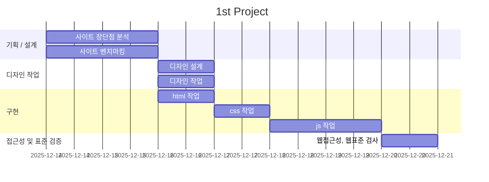

# 1st Project
- 과정명:오르미 프론트엔드 개발자 양성
- 기간:2025.10.16 ~ 2026.03.04
- 2차 프로젝트:2025.12.16 ~ 2025.12.23

## 빠른링크
- 기획서(피그마 슬라이드):[피그마 슬라이드](https://www.figma.com/slides/Jf6Hi0D7VBPaTIMzbv4QEF/%EA%B2%B0%EA%B3%BC%EB%B3%B4%EA%B3%A0%EC%84%9C?node-id=2-762&t=WqthzXDdQAVqeM62-1)
- 디자인 원본(피그마):[디자인 원본 링크](https://www.figma.com/design/c0UR88PSkkE25q1XPPOHNf/ROUNZ-LAB?node-id=0-1&t=EJzm8hNbvkj6NR0R-1)

## 1. 프로젝트 개요

### 1.1 목표
- **기존의 사이트 리뉴얼**: 시각적 재정비, 전 사용자의 구매 흐름 최적화, 크로스 디바이스 환경의 완성도 확보, 구조 개편으로 탐색 시간 단축
- **디자인과 html,css,js,  협업 경험**: 디자인과 html, css, js 를 작성하며 그 과정에서 협업을 하는 경험 쌓기
- **페이지 완성 경험**: 각자의 페이지를 완성하며, html을 작성할때의 요령과 css, js 작성 경험 쌓기
- **취업용 포트폴리오 활용**

### 1.2 팀원
| 이름 | 역할 | 주요 담당 | GitHub | 연락 |
| --- | --- | --- | --- | --- |
| 신찬섭 | 팀장 | 메인페이지 js, 회원가입 페이지 | [@haini000@naver.com] | haini000@naver.com |
| 김미경 | 팀원 | 메인페이지 디자인,html, 결제페이지 | [@meekyung09111@gmail.com] | meekyung09111@gmail.com |
| 오세찬 | 팀원 | 메인페이지 css, 장바구니 페이지 | [@oh108899@gmail.com] | oh108899@gmail.com |
| 김세은 | 팀원 | 메인페이지 디자인, 로그인 페이지 | [@yappay464@gmail.com] | yappay464@gmail.com |
| 조창희 | 팀원 | 상품상세 페이지 | [@fifa293949@gmail.com] | fifa293949@gmail.com |

### 1.3 마일스톤

#### 1일차: 기획/설계
- [ ] 라운즈 사이트의 장단점 분석
- [ ] 타 사이트 벤치마킹
- [ ] 전체적인 사이트의 컨셉 구상

#### 2일차: 디자인 작업
- [ ] 디자인 작업 진행
- [ ] 디자인 작업 마무리

#### 3일차: 디자인, html 
- [ ] html 작성
- [ ] css 작성

### 4일차: html, css
- [ ] css 완성
- [ ] 피드백 수용 후 html, css 마무리
- [ ] js 작성 시작

#### 5일차: 발표 준비 및 코드 정리
- [ ] js 완성
- [ ] 각자의 서브페이지 최종 점검

#### 6일차: 발표 준비 및 코드 정리
- [ ] 웹 접근성 검사, 웹 표준 검사
- [ ] 발표자료 제작



### 1.5 주요 기능

- 시각적 재정비
- 비회원 포함 전 사용자 구매 흐름 최적화
- 크로스 디바이스 환경의 완성도 확보
- 사용자 흐름의 간결화 및 효율 증대
- 정보 구조 재편으로 탐색 시간 단축
- 페이지 성능 로딩 개선을 통한 사용성 강화


## 2. 개발 환경 및 배포

### 2.1 개발 스택
#### **Frontend**
- HTML
- CSS
- SASS
- JS
- JQuery

#### **Tools**
- **Version Control**: Git & GitHub
- **Deployment**: VS-code
- **Design**: Figma

### 2.2 배포 URL
- https://haini000.github.io/ROUNZ-Lap/

### 2.3 📚 개발 컨벤션

- [HTML 컨벤션](docs/guide_html.md)
- [CSS 컨벤션](docs/guide_css.md)
---

## 3.프로젝트 구조
```
ESTSOFT-2nd-PROJECT/
├── css/
│   ├── common.css              # 공통 변수, 유틸리티 클래스, 레이아웃 기본 스타일
│   ├── main.css                # 메인 페이지 전용 스타일
│   ├── normalize.css           # 브라우저 간 일관성 확보
│   └── reset.css               # 모든 브라우저 기본 마진/패딩 초기화
│
├── docs/
│   ├── guide_css.md            # CSS 컨벤션
│   └── guide_html.md           # 시멘틱 태그 사용 가이드, 접근성 체크리스트
│
├── images/                     # 모든 정적 이미지 저장
│
├── js/
│   ├── modules/
│   │   ├── footer.js
│   │   ├── header.js
│   │   ├── toggleMenu.js
│   ├── cart.js             # 장바구니 관련 기능
│   ├── main.js
│   ├── signup.js
│   │
│
├── scss/
│   ├── cart.scss
│   ├── common.scss
│   ├── kcp.scss
│   ├── main.scss
│   ├── signup.scss
│   └── variables.scss
│
├── data/
│   └── glasses.json            # 상품 데이터
│
├── .gitignore
├── cart.html                   
├── detail.html                 
├── index.html                  
├── kcp.html
├── login.html
├── signup.html
└── README.md
```

## 4. 제작 후기
이번 프로젝트는 처음으로 js를 사용, 한 페이지를 혼자 구상, 구현한 프로젝트입니다. 이 프로젝트를 하며 한 페이지의 완성을 위해 시간이 꽤 오래 걸린다는걸 알았고, 시간안에 성공적인 구현을 위해선 html 작성부터 구조가 잘 되어야 한다는것을 알게 되었습니다.
### 1. 기초의 중요성
html이 무너지면 css, js까지 힘들어짐을 배웠습니다. 이번 프로젝트를 하며 html을 잘 작성해야 css,js 또한 잘 작성될 수 있음을 배웠습니다.

### 2. CSS의 설계
처음엔 그냥 생각나는대로 썼으나, 그 뒤에 클래스명의 겹침, 덮어쓰기 문제에 빠져 전체적으로 수정을 하여야 하는 수고러움에 빠졌습니다. 덕분에 CSS 작업을 하기 전 팀원들과의 충분한 협의 후 가이드와 컨벤션을 정해두고 common.css 와 main.css를 철저히 분리하여 작업하여야 한다는 것을 배웠습니다.

### 3. 생각과 구현의 차이
처음 생각으론 이부분을 js로 구현할 수 있겠지? 라는 마음이 있었습니다. 하지만 막상 해보니 쉽지 않았습니다. 프로젝트를 하며 '내가 모르는것' 이 어떤것인지 확실하게 알 수 있었습니다.

### 4. 아쉬웠던점 , 고칠점
- 메인페이지가 미완성입니다.


### 마무리
이 프로젝트를 하며 각자 라이브러리, jQuery 등 다양한 툴도 이용해보고, 하드코딩도 해볼 수 있는 시간이였습니다. 다만 시간이 부족하여 각자의 페이지도 아직 미완인 부분이 많이 생겼습니다. 프로젝트를 하며 우리가 어떤점에서 부족한지를 알 수 있었고, 앞으로도 시간 단축을 위해 노력해서 프로젝트 기간 내에 작업을 끝낼 수 있는 그런 개발자가 될 수 있도록 노력하겠습니다.